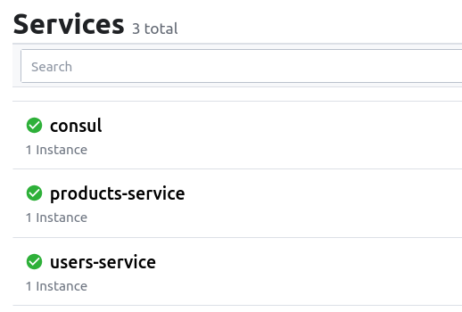
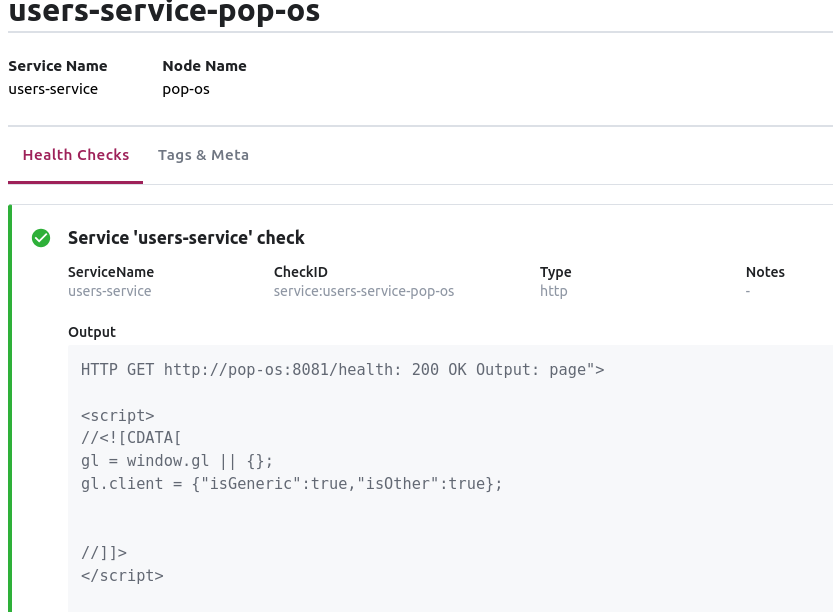
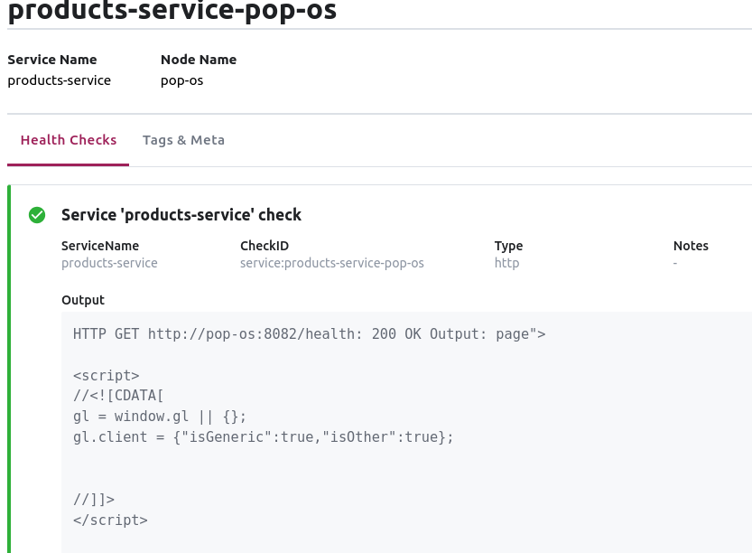
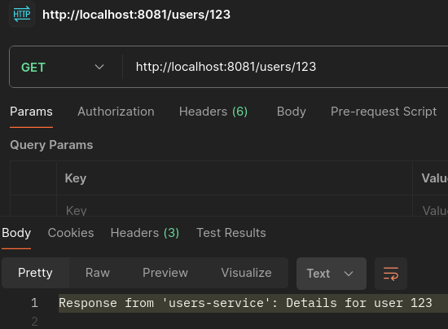
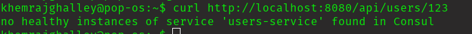
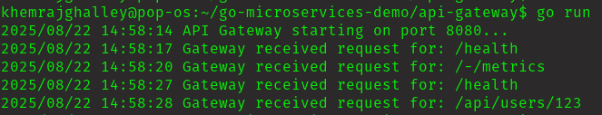

# Practical 2 Report: API Gateway with Service Discovery

## Overview

This report describes my approach, steps taken, and challenges encountered while implementing **API Gateway with Service Discovery**. The exercise involved creating two independent microservices (`users-service` and `products-service`), registering them with Consul for service discovery, and building an API Gateway to route incoming requests dynamically.

---

## Approach & Steps Taken

### 1. **Project Setup**

- Created a new directory: `go-microservices-demo`
- Structured the project as instructed:
    ```
    go-microservices-demo/
    ├── api-gateway/
    │   └── main.go
    └── services/
        ├── products-service/
        │   └── main.go
        └── users-service/
            └── main.go
    ```

### 2. **Installing Prerequisites**

- Installed Go (v1.18+), Docker, Docker Compose, and Consul.
- Verified installations using `go version`, `docker --version`, and running Consul UI.
- Installed required Go libraries:
    - `github.com/go-chi/chi/v5` (for HTTP routing)
    - `github.com/hashicorp/consul/api` (for Consul integration)

### 3. **Building Microservices**

#### a. **users-service**
- Initialized Go module: `go mod init users-service`
- Implemented `/users/{id}` endpoint and `/health` for Consul health checks.
- Registered the service with Consul on startup.

#### b. **products-service**
- Initialized Go module: `go mod init products-service`
- Implemented `/products/{id}` endpoint and `/health`.
- Registered the service with Consul similarly.

### 4. **Service Registry with Consul**

- Ran Consul in development mode using Docker:
    ```
    docker run -d -p 8500:8500 --name=consul hashicorp/consul agent -dev -ui -client=0.0.0.0
    ```
- Verified both services registered and healthy in Consul UI (`http://localhost:8500`).

### 5. **API Gateway**

- Initialized Go module: `go mod init api-gateway`
- Built routing logic to forward `/api/users/*` and `/api/products/*` requests.
- Used Consul API to discover healthy instances for each service.
- Implemented reverse proxying using Go's `httputil`.

### 6. **Testing End-to-End**

- Started four terminals: one each for Consul, users-service, products-service, and api-gateway.
- Sent requests via curl/Postman to the gateway:
    ```
    curl http://localhost:8080/api/users/123
    curl http://localhost:8080/api/products/abc
    ```
- Verified correct routing and responses.

### 7. **Demonstrating Resilience**

- Stopped users-service and confirmed Consul marked it as unhealthy.
- Verified API Gateway returned a suitable error when trying to access the stopped service.
- Restarted users-service and confirmed recovery without restarting the gateway.

---

## Challenges Encountered

- **Networking Issues:** Initially, the services registered with a Consul instance running in Docker, but the gateway (on the host) couldn’t discover them. Fixed this by running Consul locally instead.
- **Port Conflicts:** Ensured ports 8080, 8081, 8082, and 8500 were available and not in use by other processes.
- **Service Registration:** Learned the importance of health checks for resilient service discovery and troubleshooting Consul registration errors.
- **Reverse Proxy Path Rewriting:** Adjusted the gateway logic to correctly rewrite request paths before forwarding.

---

## Screenshots

1. **Consul UI with Both Services Registered and Healthy**  
   
   
   

2. **Requests via Postman/cURL**  
   
   
3. **API Gateway Terminal Output**  


---

## Repository

All code and documentation for this practical is available in my public repository:  
**[https://github.com/Khemraj9815/AS2025_WEB303_PRACTICAL/tree/main/practical_2]**

---

## Reflection

This practical helped me understand how API Gateways and service discovery tools like Consul work together to build resilient, scalable microservice architectures. I gained hands-on experience with Go, Docker, Consul, and reverse proxying, and learned how decoupling services allows for independent scaling and deployment.
